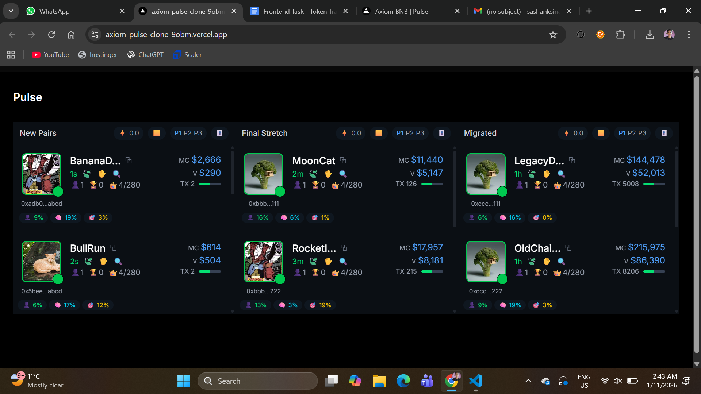
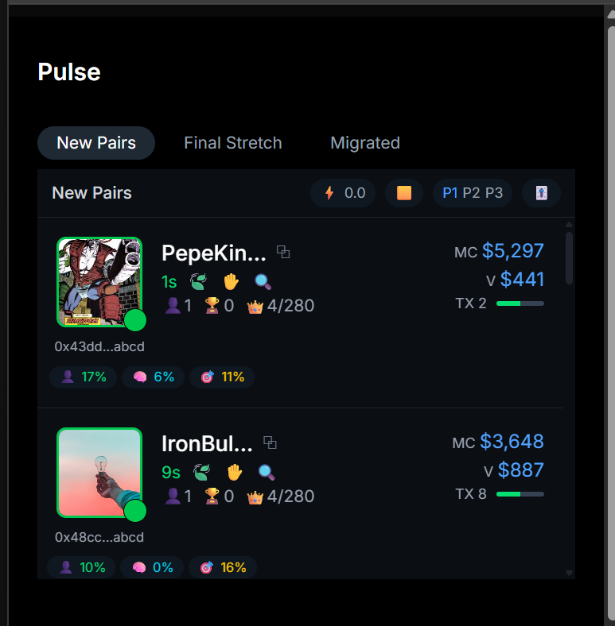
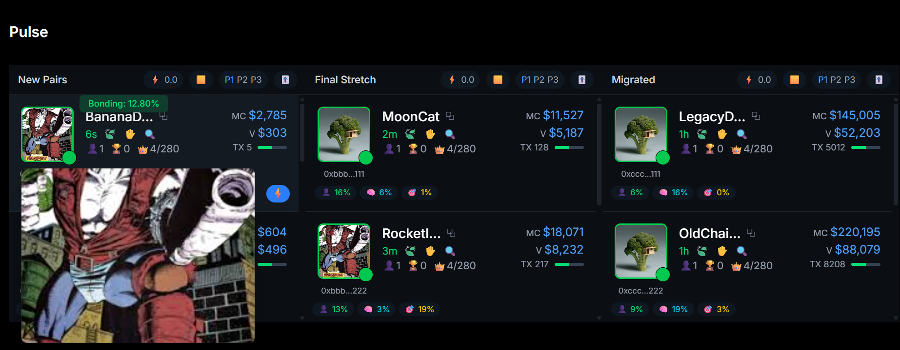

# Axiom Pulse – Token Discovery Table (Frontend Assignment)

A pixel-accurate frontend clone of **Axiom Trade’s Pulse token discovery table**, built from scratch using **Next.js 14 (App Router)**, **TypeScript**, and **Tailwind CSS**.

This project focuses on **UI precision, performance, real-time behavior, and clean architecture**, closely matching the original experience on https://axiom.trade/pulse.

---

## 🧠 Design Decisions

- Used a mock WebSocket stream to simulate real-time token updates without backend dependency.
- Chose Next.js App Router for clear server/client separation and optimal performance.
- Token data is normalized and strongly typed to ensure scalability.
- Hover interactions are CSS-driven to avoid unnecessary state and re-renders.
- UI prioritizes zero layout shift and fast interaction feedback.


## 🔗 Live Links

- **Live Demo (Vercel):** 👉 https://axiom-pulse-clone-9obm.vercel.app/
- **YouTube Demo (1–2 min):** 👉 https://youtu.be/uDKBcjHehg4
- **Original Reference:** https://axiom.trade/pulse

---

## 📸 Screenshots

### Desktop View


### Mobile View (≤ 320px)


### Hover Image Preview



## ✨ Features

### Token Discovery Columns
- **New Pairs**
- **Final Stretch**
- **Migrated**

Each column updates independently and matches the original layout and behavior.

---

### Real-Time Updates (Mock WebSocket)
- Token age updates **every second**
- Market cap, volume, and transaction count fluctuate dynamically
- New tokens appear at the **top of New Pairs** automatically
- Smooth updates with no layout shift

---

### Advanced Interactions
- **Hover image preview** (large image escapes table overflow)
- **Bonding percentage pill** on card hover
- **Action button** appears on hover (bottom-right)
- **Tooltips** for MC and Volume
- **Row click navigation** to token detail page

---

### Responsive Design
- Desktop: 3-column layout
- Mobile: **Single column with tabs** to switch between sections
- Fully responsive down to **320px width**

---

### Loading & Error States
- Skeleton loaders for columns
- Progressive loading behavior
- Safe client/server boundaries (App Router compliant)

---

## 🧱 Tech Stack

- **Framework:** Next.js 14 (App Router)
- **Language:** TypeScript (strict)
- **Styling:** Tailwind CSS
- **State Management:** Redux Toolkit (prepared for scaling)
- **Data Fetching:** React Query (mocked backend)
- **UI Utilities:** Radix UI (Tooltip)
- **Architecture:** Atomic / component-driven
- **Performance:** Memoized components, zero layout shift

---

## 🗂️ Project Structure

src/
├── app/ # App Router pages
├── components/
│ ├── table/ # Token table, columns, cards
│ └── ui/ # Reusable UI components
├── data/ # Initial token seed data
├── services/ # Real-time token stream logic
├── types/ # Shared TypeScript types
├── utils/ # Helpers (truncate, formatting)
public/
├── tokens/ # Token images


---

## ⚙️ Local Setup

```bash
# Clone the repository
git clone https://github.com/your-username/axiom-pulse-clone.git
cd axiom-pulse-clone

# Install dependencies
npm install

# Run development server
npm run dev

# Production build
npm run build
